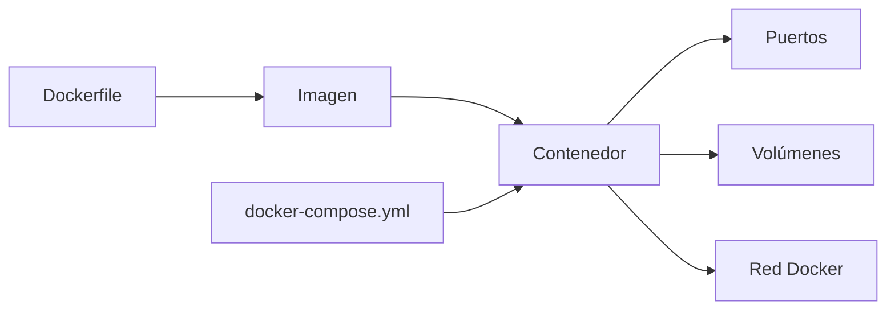
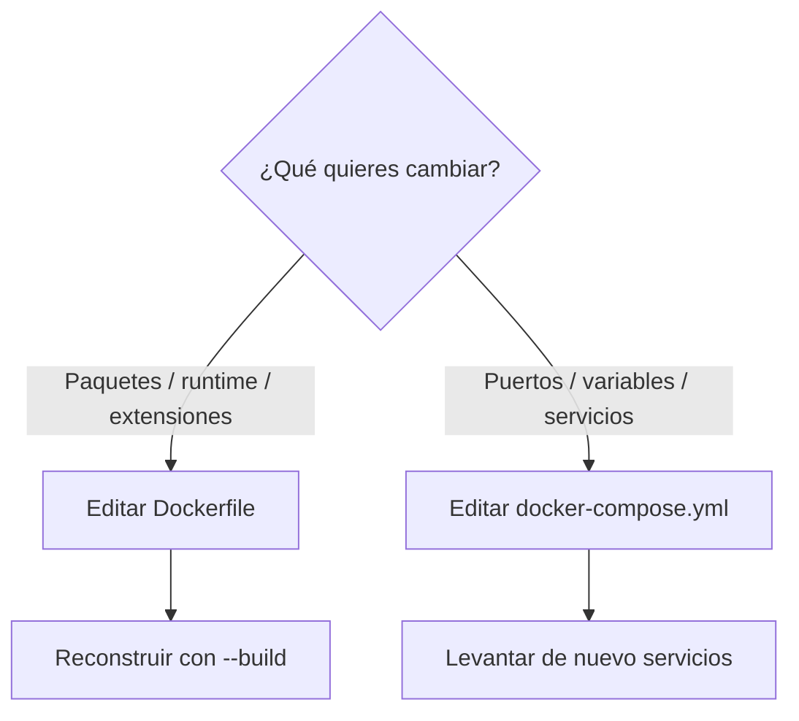

# Introducción a Docker para IMAW

[](https://www.docker.com/products/docker-desktop/)
[](https://docs.docker.com/compose/)

Guía base para entender Docker en el proyecto y arrancar el entorno sin bloqueos.

No busca que memorices todo Docker: busca darte un mapa mínimo para saber qué tocar cuando algo falla.

Nivel: `1/2` (de menos a más). Después continúa con la guía de PHP.

## Índice

- [Antecedentes y contexto](#antecedentes-y-contexto)
- [Preparación en Windows](#preparación-en-windows)
- [Mapa mental rápido](#mapa-mental-rápido)
- [Dockerfile vs docker-compose.yml](#dockerfile-vs-docker-composeyml)
- [Comandos base](#comandos-base)
- [Errores típicos](#errores-típicos)

## Antecedentes y contexto

Antes de Docker era muy común que un proyecto funcionara en el ordenador del desarrollador pero fallara en pruebas o producción por diferencias de sistema operativo, versiones de software o configuraciones. Con las máquinas virtuales (VM) se mejoró parte del problema, pero consumen más recursos porque cada VM incluye un sistema operativo completo.

Docker popularizó el uso de **contenedores ligeros**: comparten el kernel del sistema operativo anfitrión, arrancan rápido y son más eficientes en CPU y memoria que una VM tradicional.

Un **contenedor** es una unidad aislada y portable que incluye el código de la aplicación, sus dependencias, variables de entorno y el comando de arranque. La idea principal es: *"si funciona en el contenedor, funciona igual en cualquier servidor que ejecute Docker"*.

Docker permite empaquetar la aplicación y su entorno (PHP, Apache y dependencias) para que funcione de forma consistente en cualquier equipo. En IMAW, esto evita el clásico "en mi máquina funciona" y simplifica el arranque del proyecto para todo el grupo.

En lugar de instalar manualmente todo en Windows, usamos contenedores definidos en código (`Dockerfile` y `docker-compose.yml`). Así ganamos reproducibilidad, reducimos conflictos entre versiones y trabajamos con un flujo más cercano al entorno real de despliegue.

### Ventajas principales

- Portabilidad real entre equipos y entornos.
- Menor fricción entre desarrollo y sistemas.
- Entornos reproducibles y versionados.
- Mejor aprovechamiento de recursos que las VMs tradicionales.
- Onboarding rápido: nuevos miembros del equipo arrancan el proyecto en minutos.
- Encaja bien con pipelines de integración y despliegue continuo (CI/CD).

### Límites y consideraciones

- Curva de aprendizaje inicial (redes, volúmenes, seguridad).
- La gestión de datos persistentes requiere buena práctica con volúmenes.
- En producción a gran escala se suele usar orquestación (Kubernetes, Docker Swarm, etc.).

### Arquitectura típica de una app web con Docker

| Contenedor | Función |
|------------|---------|
| Nginx / Apache | Servidor web o reverse proxy |
| Aplicación (PHP, Node…) | Lógica de negocio |
| Base de datos (MySQL…) | Persistencia |
| Redis (opcional) | Caché / sesiones |

Todo se coordina con Docker Compose y se puede reproducir en cualquier máquina con un solo comando.

## Preparación en Windows

1. Instala [Docker Desktop](https://www.docker.com/products/docker-desktop/).
2. Reinicia si el instalador lo pide.
3. Abre Docker Desktop y confirma estado `Running`.
4. Activa `Use the WSL 2 based engine` en `Settings > General`.

Sin WSL2, en Windows suele haber problemas de rendimiento y compatibilidad al montar archivos del proyecto.

Comprobación:

```bash
docker --version
docker compose version
```

Si ambos comandos responden con versión, Docker CLI y Compose están disponibles correctamente.

## Mapa mental rápido

| Concepto | Traducción sencilla |
|---|---|
| Imagen | Plantilla base (ejemplo `php:8.2-apache`). |
| Contenedor | Instancia en ejecución de una imagen. |
| Volumen | Datos persistentes fuera del contenedor. |
| Red Docker | Comunicación entre servicios por nombre (`app`, `db`). |

### Diagrama conceptual rápido



## Dockerfile vs docker-compose.yml

| Archivo | Para qué sirve |
|---|---|
| `Dockerfile` | Define cómo construir una imagen. |
| `docker-compose.yml` | Define qué servicios levantar y cómo se conectan. |

Regla rápida:

- Cambias runtime o paquetes: `Dockerfile`.
- Cambias puertos, variables o servicios: `docker-compose.yml`.

Esta separación te ayuda a decidir rápido si necesitas reconstruir imagen o solo reiniciar servicios.

### Cuándo tocar cada archivo



## Comandos base

```bash
docker compose up -d --build
docker compose ps
docker compose down
```

Secuencia recomendada para empezar: `up` -> `ps` -> abrir navegador. Si algo no funciona, revisa logs antes de rehacer todo.

## Errores típicos

- Puerto ocupado: cambia el puerto publicado o cierra el proceso que lo usa.
- Docker no responde: espera a que Docker Desktop esté en `Running`.
- Cambiaste Dockerfile y no se aplica: ejecuta `docker compose up -d --build`.

## Recurso recomendado

Siguiente nivel: [Guía Docker para PHP](./GUIA_DOCKER_PHP.md).
