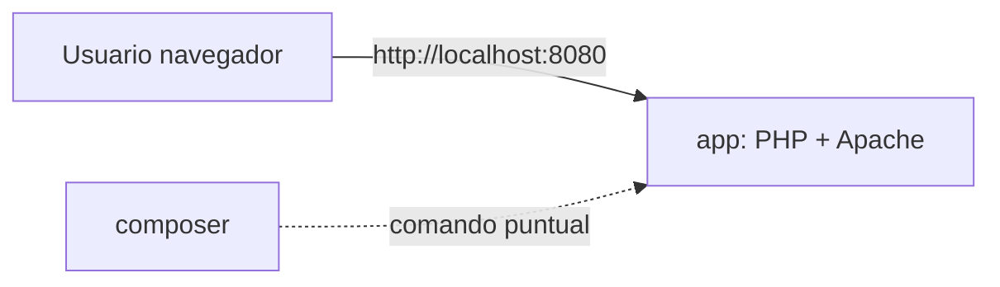
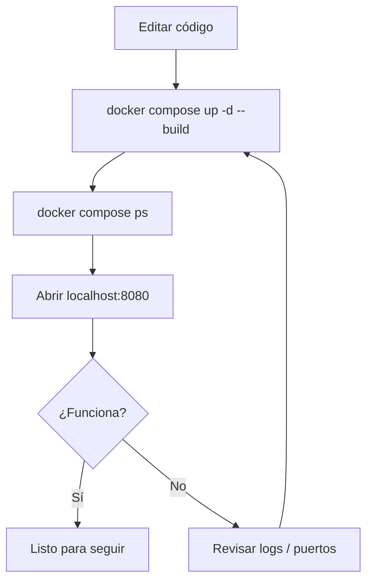

# Docker para desarrollo y pruebas en PHP

[](https://www.php.net/manual/es/)
[](https://docs.docker.com/compose/)

Guía práctica del Proyecto sin persistencia (sin BBDD) para trabajar con PHP dentro de Docker.

Nivel: `2/2` (de menos a más), después de la guía base.

## Índice

- [Paso previo](#paso-previo)
- [Requisitos](#requisitos)
- [Servicios del proyecto](#servicios-del-proyecto)
- [Arranque](#arranque)
- [Comandos de trabajo](#comandos-de-trabajo)
- [Troubleshooting rápido](#troubleshooting-rápido)

## Paso previo

Primero revisa [Guía Docker base](./GUIA_DOCKER_BASE.md).

## Requisitos

- Windows 10/11.
- Docker Desktop en `Running`.
- WSL2 activado.
- Git recomendado.

Verificación:

```bash
docker --version
docker compose version
```

## Servicios del proyecto

| Servicio | Función | Acceso |
|---|---|---|
| `app` | PHP + Apache | [http://localhost:8080](http://localhost:8080) |
| `composer` | Comandos puntuales de dependencias | `docker compose run --rm composer ...` |

### Diagrama de servicios (sin BBDD)



## Arranque

```bash
docker compose up -d --build
docker compose ps
```

### Flujo de trabajo típico



## Comandos de trabajo

```bash
# Instalar dependencias
docker compose run --rm composer install

# Añadir librería
docker compose run --rm composer require monolog/monolog

# Entrar al contenedor app
docker compose exec app bash

# Parar entorno
docker compose down
```

## Troubleshooting rápido

- Si no abre `localhost:8080`, revisa `docker compose ps`.
- Si cambias `Dockerfile`, reconstruye con `--build`.
- Si falla Composer, comprueba que existe `composer.json` en el proyecto.

## Siguiente paso

Cuando tengas el entorno en marcha, continúa con [Instalación de extensiones de VS Code](./INSTALACION_VSCODE_EXTENSIONES.md).
